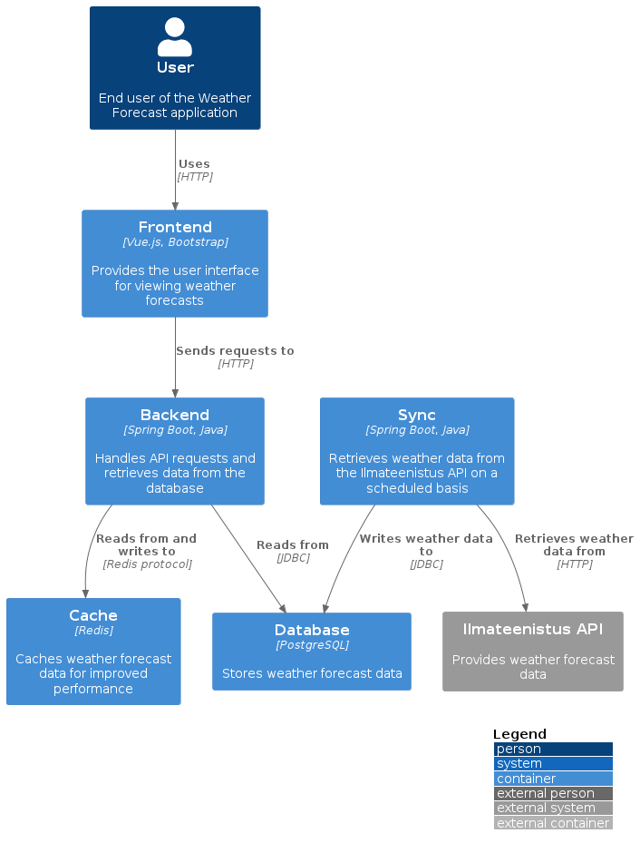

# Weather Forecast

[](https://github.com/ktenman/weather-forecast/actions/workflows/ci.yml)

## Introduction

The Weather Forecast application retrieves weather data from the Ilmateenistus API, stores it in a database, and
provides a user-friendly interface for viewing weather forecasts for various locations in Estonia.


## Prerequisites

Before you begin, ensure your system meets the following requirements:

- Java: v21.0.2
- Gradle: v8.5
- Node.js: v20.11.1
- npm: v10.2.4
- Docker: v25.0.2
- Docker Compose: v2.24.3

## Technical Stack

- **Backend**: Spring Boot v3.3
- **Frontend**:
    - **Build Tool**: Vite
    - Vue.js v3.4
    - Bootstrap v5.3
- **Database**: PostgreSQL for data persistence and Flyway for database migration management
- **Caching**: Redis, utilized for caching weather data
- **Testing**: JUnit, Mockito, AssertJ, Selenide, and Testcontainers for robust testing coverage

## Architecture 🏗️

The Weather Forecast application is built with a modular architecture in mind, comprising several key components that
seamlessly work together to deliver a top-notch user experience. Let's dive into each component and explore how they
interact with each other.



### Frontend 🌐

The frontend, built with Vue.js and Bootstrap, provides a responsive user interface. It communicates with the backend
via HTTP to retrieve and display weather forecast data.

### Backend 🧠

Developed using Spring Boot, the backend handles API requests, processes data, and interacts with the database and
cache. It exposes RESTful endpoints for the frontend to consume.

### Database 🗄️

PostgreSQL, a reliable and scalable relational database, stores the weather forecast data. The backend performs CRUD
operations using JDBC.

### Cache 🚀

Redis, an in-memory data store, is used as a caching layer to improve data retrieval performance. Frequently accessed
data is stored in the cache, reducing database queries and enhancing responsiveness.

### Sync Module ⚙️

The sync module, a separate Spring Boot application, periodically retrieves weather forecast data from the Ilmateenistus
API and updates the database. This ensures data remains up to date without burdening the main backend.

### Interaction Flow 🌡️

1. User accesses the frontend at http://localhost, triggering an HTTP request to the backend for weather forecast data.
2. Backend checks the Redis cache for the requested data.
3. If data is cached, the backend retrieves it and sends it to the frontend.
4. If data is not cached, the backend queries the PostgreSQL database.
5. Retrieved data is cached in Redis for future requests and sent to the frontend.
6. Frontend receives and displays the weather forecast data to the user.
7. Sync module periodically updates the database with the latest data from the Ilmateenistus API.

This modular architecture is like a well-oiled machine, with each component playing a crucial role in delivering a
seamless user experience. By separating concerns and promoting scalability and maintainability, our Weather Forecast
application is built to withstand the test of time. The strategic use of caching and a dedicated sync module ensures
optimal performance and data freshness, providing users with the most up-to-date weather information at their
fingertips.

## Setup and Running Instructions

### Docker Containers Setup

Initialize necessary Docker containers with Docker Compose to ensure the database and Redis services are up before
proceeding:

```
docker-compose -f compose.yml up -d
```

### Backend Setup

Navigate to the root directory and compile the Java application using Gradle:

```
cd weather-api 
../gradlew clean build
../gradlew bootRun
```

You can access Swagger documentation in your web browser at http://localhost:8080/swagger-ui/index.html

### Frontend Setup

Install frontend dependencies, and start the development server:

```
npm install
npm run dev
```

You can access it in your web browser at http://localhost:61234

### Running in Production

To run the application in production, use Docker Compose:

```
docker-compose -f docker-compose.yml up -d
```

Once the application is up and running, you can access it in your web browser at http://localhost

### Updating the Application

To update the application or its services after making changes:

1. Rebuild the services:

  ```
  docker-compose -f docker-compose.yml build
  ```

2. Restart the services for the changes to take effect:

  ```
  docker-compose -f docker-compose.yml up -d
  ```

### End-to-End Tests on Unix System

1. Start Docker Containers:

  ```
  docker-compose -f docker-compose.yml -f docker-compose.e2e.yml up -d
  ```

2. Run E2E Tests:

  ```
  cd weather-api 
  export E2E=true
  ../gradlew test --info -Pheadless=true
  ```

### Continuous Integration and Deployment

* A CI pipeline via GitHub Actions in the `.github` folder automates unit and integration tests.
* Dependabot keeps Maven and GitHub Actions versions up-to-date, automating dependency management.

### Key Features

* Weather Forecast Retrieval: Retrieves weather forecast data from the Ilmateenistus API.
* Data Persistence: Stores weather forecast data in a PostgreSQL database.
* Caching: Caches weather forecast data using Redis for improved performance.
* User Interface: Provides a user-friendly interface for viewing weather forecasts for various locations in Estonia.

---
This README aims to guide developers through setting up, running, and understanding the core functionalities and
technical aspects of the Weather Forecast application.
